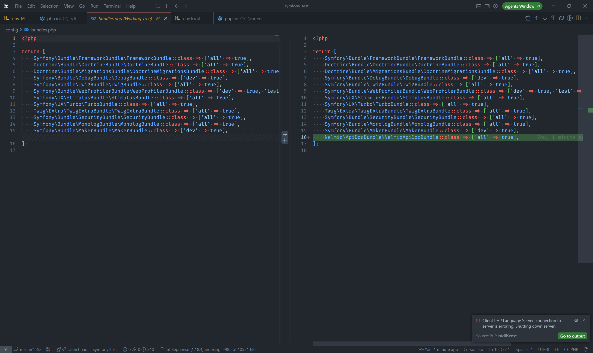
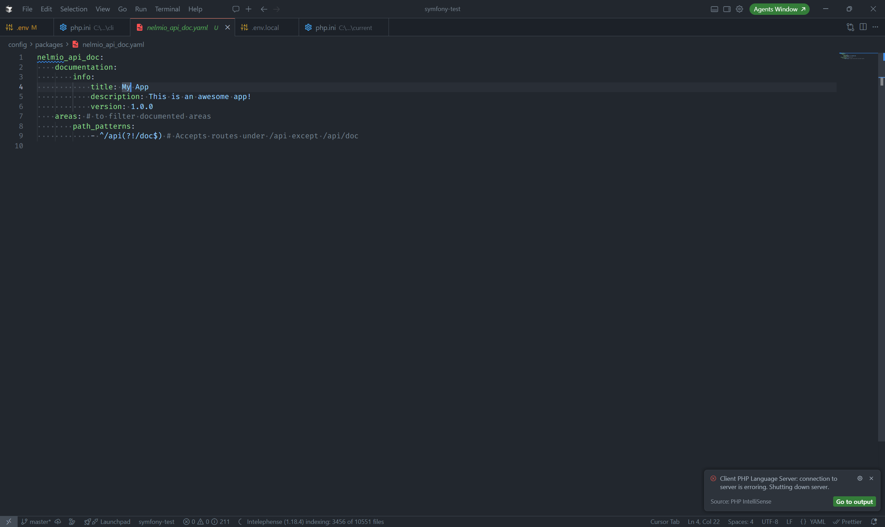
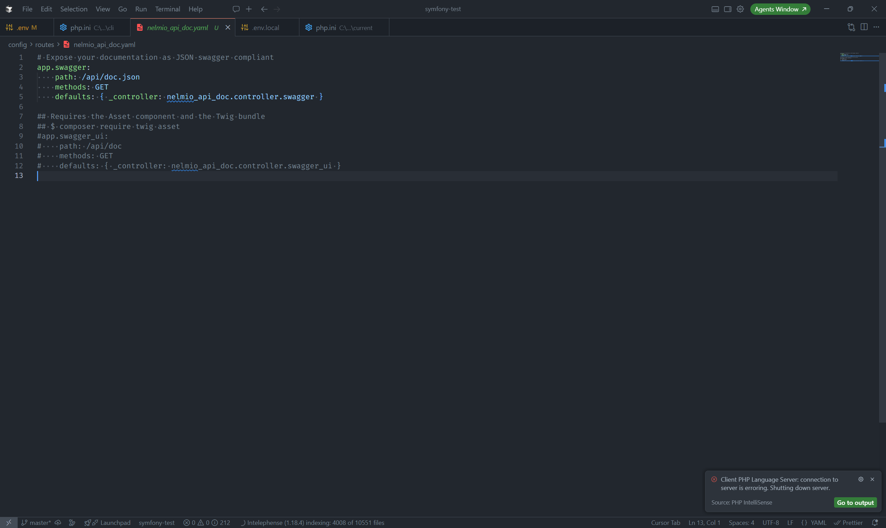

## API 문서화?

API개발을 하다보면 문서화에 대한 필요를 항상 느끼게 된다. 내가 어떤 API를 작성을 했고, 해당 API는 어떤 입력과 어떤 출력을 하는지에 대한 간단한 명세와 필요하다면 어떤 기능을 하고 어떻게 테스트 해보는지에 대한 상세한 설명이 포함된 문서 말이다. 다만 게으른 개발자들은 해당 문서보다는 프로젝트 자체를 잘 만들어야 한다고 생각하고 문서는 작성안하는 경우가 많다. 그래서 프론트엔드 개발할때 다시 한번 힘들어지기 마련이다.

### 게을러서?

그럼 이 문제를 바라볼때 단순히 그 사람이 게을러서 안했다고 해야할까? 물론 "성실한" 개발자들은 본인들이 개발한거에 대해 일일히 사용법과 테스트를 작성하는 걸까? 생각해보면 바빠서 못하는 것도 맞다. 그런데 우리는 그사람이 단순히 게을러서 그렇다고 말해봤자 의미가 없다. 결국엔 힘들어지는 건 그 게으른 개발자를 포함한 모두이기 때문이다. "게을러서" 문서작성을 안하는게 아니다. 문서 작성할 시스템이 갖춰지지 않았기 때문이다.

## Swagger

[Swagger UI](https://swagger.io/tools/swagger-ui/)는 그에 API문서에 대한 가장 심플하면서도 강력한 문서 제조 툴이라고 생각한다. 입출력에 대한 부분은 물론이고, 각 API에 간단한 설명도 붙일 수 있고, 테스트까지 가능하니 말이다. 문제는 해당 API 문서 작성을 위해 별도의 `json`이나 `yaml` 파일을 준비해야 한다는 거다. `html`보다는 낫지 않냐고 말할 수 있겠으나 사실 파일을 인간이 만들어야 한다는거 자체가 문제인거다. 그러면 API개발자는 다음과 같은 개발 패턴을 보여야 한다.

1. 현재 어떤 기능이 필요한지 확인 후 설계한다.
2. 실제로 해당 기능이 현재 없는지 `Swagger` 혹은 직접 코드를 찾아보며 확인한다.
3. 만약 없다면 그에 맞는 기능을 개발한다.
4. 개발이 완료되었다면, 해당 기능을 소개 및 테스트 할 수 있게 `Swagger`파일을 업데이트 한다.

3번까지는 모두 할 거라 생각은 든다. 하지만 4번까지 성실하게 하는 사람이 몇이나 될까. 게을러서 안하는 사람도 있겠지만, 실제로 개발자는 성실한데 현재 일이 다른일이 바빠서 4번을 못했다면 그걸 누가 눈치챌수 있을까? 결론은 **인간이 Swagger파일을 업데이트**하는 행위 자체가 문제라는 결론에 다다른다.

### Swagger 자동화

결국 목적은 다음과 같다. 문서 작성은 개발 완료와 동시에 되어야 한다. 완전 자동화는 아니더라도 하다못해 편리하긴 해야한다. 문제는 `PHP`의 문제점도 있다.

PHP는 인터프리터 언어다. Java나 TypeScript처럼 빌드 단계에서 소스코드 전체를 정적으로 분석하는 과정이 없다. 이 차이가 문서 자동화를 어렵게 만드는 핵심이다.

Java Spring의 경우 빌드 타임에 `@RequestMapping`, `@GetMapping` 같은 어노테이션을 컴파일러가 읽어 라우팅 전체를 파악할 수 있다. TypeScript 기반 프레임워크도 마찬가지다. 빌드 결과물을 정적으로 분석하면 어떤 엔드포인트가 존재하고, 어떤 타입이 오가는지 비교적 정확하게 추론이 가능하다.

반면 PHP는 런타임에 코드가 해석되기 때문에, 실제로 서버가 실행되기 전까지는 어떤 라우트가 존재하는지 시스템 입장에서 온전히 알기 어렵다. 라우팅이 어노테이션으로 정의되든, YAML로 정의되든, 아니면 코드 내에서 동적으로 생성되든 간에 정적 분석만으로는 한계가 있다. 입출력 타입 추론은 더 어렵다. PHP는 동적 타입 언어의 특성을 지니고 있어서, 함수 시그니처에 타입이 명시되어 있지 않으면 어떤 값이 들어오고 나가는지 코드만 보고 추론하기가 쉽지 않다.

결국 PHP 환경에서의 Swagger 자동화는 태생적으로 언어 구조의 제약을 안고 출발한다는 걸 인정해야 한다.

### API Doc Bundle

그러면 Symfony 환경에서는 가능할까? 놀랍게도 완전 자동화는 불가하다. 결국 어떤 입력과 어떤 출력이 나가는지는 작성을 해줘야 하나 그 방식을 꽤나 간단하게 해줄 수 있는 라이브러리가 있다. [nelmio/api-doc-bundle](https://symfony.com/bundles/NelmioApiDocBundle/current/index.html)은 Symfony 공식 홈페이지에 문서가 있는 API Document 작성 라이브러리이다.

## Nelmio Api Doc 설치 및 설정

Composer를 활용해 우선 프로젝트에 설치해보자.

```bash
composer require nelmio/api-doc-bundle
```

설치 후에는 설정레시피를 적용할 건지 물어본다. 레시피 적용시 **bundle**, **config/packages/nelmio-api-doc.yaml**, **config/routes/nelmio-api-doc.yaml** 세가지 파일이 생성된다. 해당 파일을 확인하면, 다음과 같다.







Bundles에 추가된건 Nelmio-api-doc이란 번들을 설치한 것이기에 따로 설명은 하지 않겠다. 다만 packages 와 routes 하위에 있는 두 설정파일은 반드시 알아야 하는 내용이다.

### packages/nelmio-api-doc.yaml

해당 파일은 Swagger API를 제작할때 사용되는 메타데이터라고 보면 된다. 내용을 살펴보면 다음과 같다.

```yaml
nelmio_api_doc:
    documentation:
        info:
            title: My App # App 이름
            description: This is an awesome app! # App 설명
            version: 1.0.0 # App 버전
    areas: 
        path_patterns:
            - ^/api(?!/doc$) # Accepts routes under /api except /api/doc
```

info에 있는 데이터는 간단하니 넘어가고 areas만 주의깊게 보면 된다. `area`는 우리가 문서로 나눌 API의 구분이라고 생각하면 된다. 어떤식으로 사용되는지 예시를 들어보면 다음과 같다.

일반 사용자와 관리자 사용자가 구분되는 서비스가 있다고 가정해보자. 우리가 해당 서비스를 개발한다면 너무나 당연하게 일반 사용자가 알 수 있고, 접근가능한 API의 범위와 관리자가 알고, 접근 가능한 API의 엔드포인트는 명확하게 다를 것이다. 그러면 백엔드 개발자인 우리는 두 API문서를 분리할 필요가 있다. 이때 분리할 수 있는것이 `area`이다.
위와 같은 서비스를 개발할때 `public area`, `admin area` 총 두개로 구분해 개발하고 문서로 구분해주면 좋다. 자세한 설명은 [공식 문서](https://symfony.com/bundles/NelmioApiDocBundle/current/areas.html)를 참조하면 좋다.

### routes/nelmio-api-doc.yaml

해당 파일은 Swagger API 문서 파일에 접근하기 위한 라우팅 파일이다. 

```yaml
app.swagger:
    path: /api/doc.json
    methods: GET
    defaults: { _controller: nelmio_api_doc.controller.swagger }
```

기본 레시피로 설정한 파일에 `api/doc.json`이 명시되어 있다. 해당 URL로 접근하면 다음과 같은 Response가 나온다.

```json
{
  "openapi": "3.0.0",
  "info": {
    "title": "My App",
    "description": "This is an awesome app!",
    "version": "1.0.0"
  },
  "paths": {

  }
}
```

현재는 별도의 API엔드포인트를 만들어둔 상태가 아니니 `paths`가 비어있지만 우리가 계속해서 작성해나면 해당 paths가 채워지는 형식일 것이다. 그러면 여기서 의문점이 들거다.

> 아니 이건 JSON파일이지 테스트 해볼 수 있는 UI가 없잖아?

나 역시 처음에 같은 의문이 들었다. 우리가 테스트할 수 있는 웹페이지는 Swagger가 아니라 [Swagger UI](https://swagger.io/tools/swagger-ui/)이다. Swagger UI는 위처럼 작성되는 JSON문서를 이용해 테스트 환경을 구축해주는 Tool인거다.
즉 저 JSON이 있다면 Swagger UI 말고도 다른 테스팅 UI 환경을 제공할 수 있다는 거다. 이는 [공식문서](https://symfony.com/bundles/NelmioApiDocBundle/current/index.html#installation)를 보면 더 자세히 나오니 참고해보면 좋다. 다만 Swagger UI가 제일 익숙하기도 하고 Swagger UI만 더 엔드포인트를 추가해서 사용하면 좋다.

```yaml
app.swagger:
    path: /api/doc.json
    methods: GET
    defaults: { _controller: nelmio_api_doc.controller.swagger }

# /api/doc 접근 시 swagger_ui로 매핑해준다.
app.swagger_ui:
    path: /api/doc
    methods: GET
    defaults: { _controller: nelmio_api_doc.controller.swagger_ui }
```


Swagger UI를 활용하기 위해서는 Twig 번들과 Asset 패키지가 필수적이니 혹시나 순수 API 서버만 구축하기 위해 설치하지 않았다면 함께 설치해주면 된다. 
추가로 상단에 Nelmio 로고가 거슬린다거나 내부 UI를 좀 더 깔끔하게 디자인하고 싶다면 [공식문서](https://symfony.com/bundles/NelmioApiDocBundle/current/customization/ui.html)를 참조해서 커스터마이징을 해보면 좋을것이다.

### 그래서 자동화는 어떻게...

예제로 로그인하는 API를 구성해봤다고 가정해보자. 보통 이런식으로 작성될것이다.

```php
final class AuthController extends AbstractController
{
    #[Route('/api/auth/login', name: 'app_auth_login', methods: ['POST'])]
    public function login(Request $request): JsonResponse
    {
        $data = json_decode($request->getContent(), true);
        $email = $data['email'];
        $password = $data['password'];

        // 로그인 행위

        return $this->json([
            'message' => 'Login successful',
            'user' => null, // User 객체 정보
        ]);
    }
}
```

해당 엔드포인트는 다음과 같은 입출력을 가진다.

- 입력 : 이메일(필수), 비밀번호(필수)
- 출력 : 메시지(필수), 사용자객체(선택 -> 로그인 성공시에만 반환)

그러면 이를 Swagger에 표기가 되면 되는데, 현재 저런식으로 작성될 시에는 Nelmio API Doc 이 알아보지 못한다. 그도 그럴 것이 해당 메서드의 입출력은 다음과 같다.

- 입력 : Request
- 출력 : JsonResponse

이를 코드적으로 알아볼 수가 없고 실제로 Document는 다음과 같이 출력된다.

```json
{
    "openapi": "3.0.0",
    "info": {
        "title": "My App",
        "description": "This is an awesome app!",
        "version": "1.0.0"
    },
    "paths": {
        "/api/auth/login": {
            "post": {
                "operationId": "post_app_auth_login",
                "responses": {
                    "default": {
                        "description": ""
                    }
                }
            }
        }
    }
}
```

description이나 operationId같은 메타데이터는 차치하고서라도 입출력조차 제대로 표시되지 않아서 문서로서 의미가 전혀없다. 그래서 다음과 같은 Attribute데이터를 메서드에 추가해줘야 한다.

```php
use OpenApi\Attributes as OA;

final class AuthController extends AbstractController
{
    #[Route('/api/auth/login', name: 'app_auth_login', methods: ['POST'])]
    #[OA\Post(
        operationId: 'tryLogin',
        tags: ['Auth'],
        summary: '로그인',
        description: '사용자 이메일과 패스워드를 입력받아 로그인을 시도합니다.',
        requestBody: new OA\RequestBody(
            required: true,
            content: new OA\JsonContent(type: 'object', properties: [
                new OA\Property(property: 'email', type: 'string'),
                new OA\Property(property: 'password', type: 'string'),
            ]),
        ),
        responses: [
            new OA\Response(response: 200, description: 'Login successful', content: new OA\JsonContent(type: 'object', properties: [
                new OA\Property(property: 'message', type: 'string'),
                new OA\Property(property: 'user', type: 'object', properties: [
                    new OA\Property(property: 'id', type: 'integer'),
                    new OA\Property(property: 'email', type: 'string'),
                    new OA\Property(property: 'roles', type: 'array', items: new OA\Items(type: 'string')),
                ]),
            ])),
            new OA\Response(response: 401, description: 'Unauthorized', content: new OA\JsonContent(type: 'object', properties: [
                new OA\Property(property: 'message', type: 'string'),
            ])),
        ],
    )]
    public function login(Request $request): JsonResponse
    {
        return $this->json([
            'message' => 'Login successful',
            'user' => null, // User 객체 정보
        ]);
    }
}
```

해당 요청에 대한 메타데이터와 Request, Response를 위와 같이 정리하게 된다면 Swagger도 자동으로 적용된다.

```json
{
  "openapi": "3.0.0",
  "info": {
    "title": "My App",
    "description": "This is an awesome app!",
    "version": "1.0.0"
  },
  "paths": {
    "/api/auth/login": {
      "post": {
        "summary": "로그인",
        "description": "사용자 이메일과 패스워드를 입력받아 로그인을 시도합니다.",
        "operationId": "tryLogin",
        "requestBody": {
          "required": true,
          "content": {
            "application/json": {
              "schema": {
                "properties": {
                  "email": {
                    "type": "string"
                  },
                  "password": {
                    "type": "string"
                  }
                },
                "type": "object"
              }
            }
          }
        },
        "responses": {
          "200": {
            "description": "Login successful",
            "content": {
              "application/json": {
                "schema": {
                  "properties": {
                    "message": {
                      "type": "string"
                    },
                    "user": {
                      "properties": {
                        "id": {
                          "type": "integer"
                        },
                        "email": {
                          "type": "string"
                        },
                        "roles": {
                          "type": "array",
                          "items": {
                            "type": "string"
                          }
                        }
                      },
                      "type": "object"
                    }
                  },
                  "type": "object"
                }
              }
            }
          },
          "401": {
            "description": "Unauthorized",
            "content": {
              "application/json": {
                "schema": {
                  "properties": {
                    "message": {
                      "type": "string"
                    }
                  },
                  "type": "object"
                }
              }
            }
          }
        }
      }
    }
  }
}
```

Swagger UI도 당연히 적용된다.


### 이딴게... 자동화...?

하지만 이런식으로 작성하면 단순하게 yaml파일을 각 메서드별로 쪼개서 작성하는것과 전혀 다를것이 없다. 따라서 적극적으로 활용되야 하는게 `Model`이다.
[Model](https://swagger.io/docs/specification/v3_0/data-models/data-models/)을 쉽게 설명하면, 각 API에서 활용되는 DTO라고 보면 된다. 각 API별로 단순한 매개변수들로 움직이는게 아니라 데이터 단위로 요청이 이뤄지기에 이를 Model이라는 단위로 묶어서 문서를 구성하면 효율이 더욱 올라간다.
자 아까 작성했던 Attribute를 Model을 활용하면 다음과 같아진다.
우선 각 입력과 출력을 DTO로 만든다.

```php
<?php

namespace App\Dto\Request;

use Symfony\Component\Validator\Constraints as Assert;

class LoginRequestDto
{
    public function __construct(
        #[Assert\NotBlank]
        #[Assert\Email]
        public string $email,
        #[Assert\NotBlank]
        public string $password,
    ) {}
}
```

```php
<?php

namespace App\Dto\Response;

use App\Dto\View\UserViewDto;

class LoginResponseDto
{
    public function __construct(
        public string $message,
        public ?UserViewDto $user = null,
    ) {}
}
```

```php
<?php

namespace App\Dto\View;

class UserViewDto
{
    public function __construct(
        public int $id,
        public string $email,
        public array $roles,
    ) {}
}
```

그 후 Attribute에 Model을 명시해준다.

```php
use Nelmio\ApiDocBundle\Attribute\Model;
use OpenApi\Attributes as OA;

final class AuthController extends AbstractController
{
    #[Route('/api/auth/login', name: 'app_auth_login', methods: ['POST'])]
    #[OA\Post(
        operationId: 'tryLogin',
        tags: ['Auth'],
        summary: '로그인',
        description: '사용자 이메일과 패스워드를 입력받아 로그인을 시도합니다.',
        requestBody: new OA\RequestBody(
            required: true,
            content: new Model(type: LoginRequestDto::class),
        ),
        responses: [
            new OA\Response(response: 200, description: 'Login successful', content: new Model(type: LoginResponseDto::class)),
            new OA\Response(response: 401, description: 'Unauthorized', content: new Model(type: LoginResponseDto::class)),
        ],
    )]
    public function login(Request $request): JsonResponse
    {
        return $this->json([
            'message' => 'Login successful',
            'user' => null, // User 객체 정보
        ]);
    }
}
```

아까보다는 훨씬 짧아지긴 했어도 그래도 긴 느낌이 든다. 여기서는 Symfony에서 사용되는 DTO 매핑을 사용하면 더욱 짧아진다. 추가로 Tag에 대한 것도 보통 Controller단위로 이뤄지니 Controller로 올려준다.

```php
use OpenApi\Attributes as OA;
use Nelmio\ApiDocBundle\Attribute\Model;
use Symfony\Component\HttpKernel\Attribute\MapRequestPayload;

#[OA\Tag(name: 'Auth')]
final class AuthController extends AbstractController
{
    #[Route('/api/auth/login', name: 'app_auth_login', methods: ['POST'])]
    #[OA\Post(
        operationId: 'tryLogin',
        summary: '로그인',
        description: '사용자 이메일과 패스워드를 입력받아 로그인을 시도합니다.',
        responses: [
            new OA\Response(response: 200, description: 'Login successful', content: new Model(type: LoginResponseDto::class)),
            new OA\Response(response: 401, description: 'Unauthorized', content: new Model(type: LoginResponseDto::class)),
        ],
    )]
    public function login(
        #[MapRequestPayload] LoginRequestDto $loginRequestDto
    ): JsonResponse {
        return $this->json(new LoginResponseDto('Login successful', null));
    }
}
```

Symfony에서는 `MapRequestPayload`를 비롯해 각 입력을 DTO로 변환해주고 있다. 이를 사용하면 Request에 대한걸 따로 Attribute에 명시해주지 않아도 API Doc에 사용이 가능하다. 자세한 사용법은 [공식문서](https://symfony.com/bundles/NelmioApiDocBundle/current/symfony_attributes.html)에서 확인 가능하다.

### 최종 사용법

Nelmio API Doc을 활용해 Swagger 문서 자동화를 제일 효율적으로 하는 방법은 다음과 같이 정리된다.

1. 메타데이터는 operationId, summary, description 총 세가지로 정한다.
2. Request와 Response는 최대한 DTO를 활용하여 관리한다.
3. RequestDto에 대한 매핑은 `MapRequestPayload`등 Symfony에서 제공하는 Dto 매핑 Attribute를 최대한 활용한다.
4. Tag에 대한 관리는 Controller별로 진행한다.

위 4가지만 지키면서 개발을 진행하면 충분히 문서 작성에 부담감이 느껴지지 않았다.

## 총평

문서는 개발된 코드 산출물에 대한 최신정보를 보기 좋게 정리해야 한다고 생각한다. 다만 문서 작성을 전적으로 개발자 각각의 **성실함**에 맡겼다가는 코드에는 있고 문서에는 빠져있는 오류가 발생하거나, 문서가 최신의 코드와 맞지 않고 과거 코드를 설명하는 문서부패가 일어나기 일쑤이다. 결국 문서가 자동으로 생성되고 이를 시스템화해야 한다는게 내 생각이다. Symfony에서는 이를 `Nelmio Api Doc`으로 이뤘고 꽤나 만족하면서 사용중이다.

그러면서 API 문서 자동화의 본질이 무엇인지도 다시 생각해보게 됐다. 결국 핵심은 **시스템이 우리의 코드를 읽을 수 있게 만드는 것**이다. `MapRequestPayload`를 통해 Request를 DTO에 매핑하는 순간, 시스템 입장에서는 "이 엔드포인트에 어떤 데이터가 들어오는지"를 코드에서 직접 읽어낼 수 있다. 명시적인 계약이 코드 안에 생기는 셈이다. 그래서 Request에 대한 문서는 별도의 Attribute 없이도 자연스럽게 작성이 가능했다.

반면 Response는 다르다. 메서드의 반환 타입은 항상 `JsonResponse`로 고정되다 보니, 실제로 어떤 데이터가 담겨 나가는지를 시스템이 코드에서 읽어낼 방법이 없다. 결국 Response DTO를 `#[OA\Response]`로 일일이 명시해줘야 하는데, 이 부분이 자동화의 마지막 남은 빈틈처럼 느껴진다. Request처럼 반환 타입도 코드에 자연스럽게 녹아들어서 시스템이 유추할 수 있었다면 더욱 이상적인 자동화였을 텐데, 아직 그 부분까지는 해결이 아쉽다.
