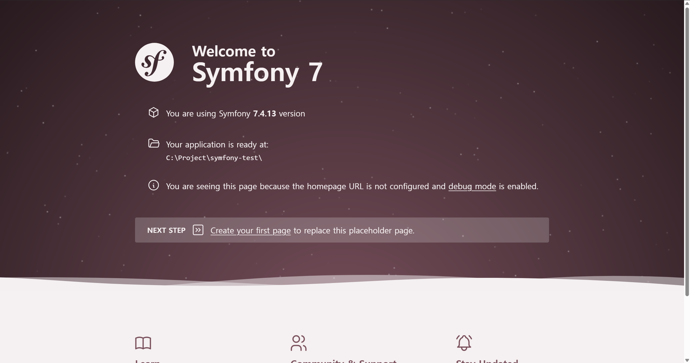
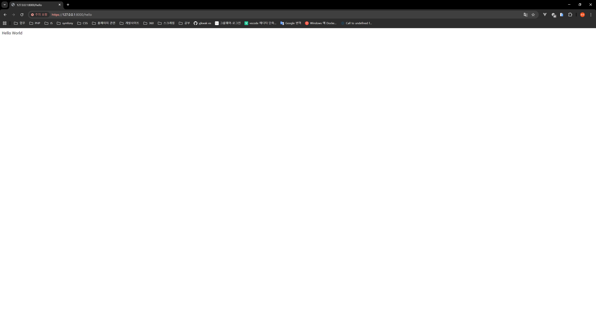

> 본 문서는 Symfony 7.4 기준으로 작성되었습니다. 다른 버전을 사용한다면 [공식 설치 문서](https://symfony.com/doc/7.4/setup.html)를 함께 확인하는 것을 추천합니다.

## Symfony로 프로젝트 만들기

Symfony는 [Symfony CLI](https://symfony.com/download)를 제공합니다. 필수는 아니지만, 새 프로젝트 생성부터 로컬 서버 실행까지 자주 쓰는 기능을 묶어두었기 때문에 처음 시작할 때 설치해두면 편합니다.

Symfony CLI를 설치한 뒤 작업할 디렉토리에서 다음 명령어로 프로젝트를 만들 수 있습니다.

```bash
# 일반적인 웹 애플리케이션을 만들 때
symfony new my_project_directory --version="7.4.*" --webapp

# API 서버나 마이크로서비스처럼 작은 골격으로 시작할 때
symfony new my_project_directory --version="7.4.*"
```

`--webapp` 옵션은 Twig, Doctrine, Security 등 웹 애플리케이션에서 자주 사용하는 패키지를 함께 설치합니다. 화면을 렌더링하는 서비스나 관리자 페이지처럼 기본 구성이 넓게 필요한 프로젝트라면 `--webapp`으로 시작하는 편이 빠릅니다.

반대로 순수 API 서버처럼 필요한 패키지가 비교적 명확한 프로젝트라면 옵션 없이 시작한 뒤 Composer로 하나씩 추가해도 좋습니다. 저는 API 서버를 만들 때는 작은 골격으로 시작하고, Doctrine이나 문서화 도구처럼 필요한 패키지만 나중에 붙이는 방식을 선호합니다.

## 폴더 구조 살펴보기

`--webapp` 옵션으로 설치하면 대략 다음과 같은 구조가 만들어집니다.

```bash
├── public/              # 웹 서버가 직접 접근하는 공개 디렉토리
├── src/
│   ├── Controller/      # 요청 처리와 응답 반환
│   ├── Entity/          # 데이터베이스 테이블과 매핑되는 객체
│   └── Repository/      # 엔티티 조회 로직
├── config/              # 라우팅, 서비스, 패키지 설정
├── templates/           # Twig 템플릿
├── tests/               # 테스트 코드
├── translations/        # 번역 파일
├── .env                 # 로컬 환경 변수
└── composer.json        # PHP 의존성 관리
```

MVC 구조로 보면 Controller는 `src/Controller`, View는 `templates`, Model에 가까운 데이터 접근 계층은 `src/Entity`와 `src/Repository`에 위치합니다. 서비스 클래스나 도메인 로직은 보통 `src` 아래에 역할에 맞는 디렉토리를 추가해서 관리합니다.

## 로컬 서버 실행하기

프로젝트 생성이 끝났다면 먼저 로컬 서버를 실행합니다.

```bash
cd my_project_directory
symfony server:start
```

브라우저에서 안내된 주소로 접속했을 때 `APP_ENV=dev` 환경이라면 Symfony 웰컴 페이지와 디버그 안내가 보입니다. 여기까지 확인되면 프로젝트 생성과 로컬 실행은 정상입니다.



`--webapp`으로 설치했지만 아직 데이터베이스를 연결하지 않았다면 `.env`의 `DATABASE_URL`은 자신의 환경에 맞게 수정해야 합니다. 단순히 첫 페이지를 띄워보는 단계라면 데이터베이스 연결을 바로 사용하지 않으므로, Doctrine을 실제로 쓰기 전까지는 이 설정이 필요하다는 정도만 기억해두면 됩니다.

## Hello World 만들기

이제 간단한 페이지를 하나 만들어보겠습니다. Symfony 7.4에서도 Attribute 기반 라우팅을 그대로 사용할 수 있습니다. `src/Controller/HelloController.php` 파일을 만들고 다음처럼 작성합니다.

```php
<?php

namespace App\Controller;

use Symfony\Component\HttpFoundation\Response;
use Symfony\Component\Routing\Attribute\Route;

class HelloController
{
    #[Route('/hello', name: 'hello_index')]
    public function index(): Response
    {
        return new Response('Hello World');
    }
}
```

위 코드는 `/hello` 경로로 들어온 요청에 `Hello World` 문자열을 그대로 응답합니다. 브라우저에서 `http://127.0.0.1:8000/hello`로 접속하면 다음처럼 문구가 출력됩니다.



## Twig 템플릿 사용하기

문자열만 반환하는 것도 가능하지만, 실제 웹 페이지를 만들 때는 템플릿을 사용하는 경우가 많습니다. `--webapp`으로 프로젝트를 만들었다면 Twig가 함께 설치되어 있으므로 바로 사용할 수 있습니다.

먼저 `templates/hello/index.html.twig` 파일을 만듭니다.

```twig
<div>
    <h1>Hello World</h1>
    <p>{{ controller_name }}</p>
</div>
```

그 다음 Controller가 `Response`를 직접 생성하는 대신 Twig 템플릿을 렌더링하도록 바꿉니다. 이때 `AbstractController`를 상속하면 `render()` 메서드를 편하게 사용할 수 있습니다.

```php
<?php

namespace App\Controller;

use Symfony\Bundle\FrameworkBundle\Controller\AbstractController;
use Symfony\Component\HttpFoundation\Response;
use Symfony\Component\Routing\Attribute\Route;

class HelloController extends AbstractController
{
    #[Route('/hello', name: 'hello_index')]
    public function index(): Response
    {
        return $this->render('hello/index.html.twig', [
            'controller_name' => 'HelloController',
        ]);
    }
}
```

다시 `/hello`로 접속하면 Twig 템플릿이 렌더링된 화면을 확인할 수 있습니다. 더 자세한 내용은 [Symfony 7.4 템플릿 문서](https://symfony.com/doc/7.4/templates.html)와 [첫 페이지 만들기 문서](https://symfony.com/doc/7.4/page_creation.html)를 참고하면 좋습니다.
