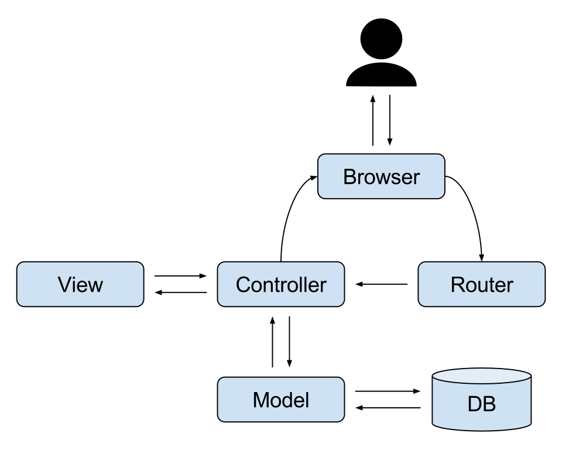

## MVC 패턴을 아시나요

많은 웹 개발자에게 MVC 패턴을 아냐고 물어보면 대다수는 안다고 대답할 것이다. 하지만 아는 것과 쓰는 것은 다르다. 주니어 개발자 시절에 흔히 저지르는 실수 중 하나이고, 나 역시 회사에서 레거시 코드를 정리하는 과정에서 뒤늦게 깨달은 것들이다.

## MVC의 일반적 정의

MVC가 뭔가요? 이렇게 물으면 보통 "Model, View, Controller 구조다!"라고만 대답할 것이다. 그러면 각 객체의 역할을 한번 정의해보자.



- **Model**: 데이터베이스 조회 및 처리
- **View**: 사용자 인터페이스
- **Controller**: 사용자 요청에 따른 응답 처리

각 객체는 **독립적**이어야 하며, 서로의 책임과 역할이 분리돼야 한다. 일반적인 백엔드 프레임워크에서 굉장히 자주 사용되는 패턴이기에 백엔드 개발자라면 반드시 알아야 한다고 생각한다.

> 한 가지 짚고 넘어가자면, 이 글에서 말하는 **Model은 데이터 접근을 담당하는 Repository에 가까운 개념**이다. 정통 MVC에서 Model은 도메인의 상태와 비즈니스 로직까지 포함하지만, 여기서는 "데이터를 조회하고 저장하는 계층"이라는 좁은 의미로 사용한다. Repository를 포함한 계층 분리에 대한 이야기는 뒤에서 다룰 예정이다.

## 이걸 왜 써야 하죠?

실제로 업무를 하면서 프레임워크 없이 단순 PHP 코드로 개발된 프로젝트를 본 적이 있었다. 회원가입을 예로 들어보자. 다음은 MVC 없이 단순 PHP로 개발했을 때 나올 법한 코드다.

```php
<?php
/**
 * signup.php
 * 회원가입 입력 폼
 */

$method = $_SERVER['REQUEST_METHOD'];
if ($method === 'POST') {
    $username = $_POST['username'];
    $email = $_POST['email'];
    $password = password_hash($_POST['password'], PASSWORD_DEFAULT);

    $conn = new mysqli('localhost', 'root', 'password', 'test');
    $conn->set_charset('utf8');

    $sql = "SELECT * FROM users WHERE username = ?";
    $stmt = $conn->prepare($sql);
    $stmt->bind_param('s', $username);
    $stmt->execute();
    $result = $stmt->get_result();
    $isExistUser = $result->fetch_assoc();
    if ($isExistUser) {
        echo '이미 존재하는 사용자입니다.';
        exit;
    }

    $sql = "INSERT INTO users (username, email, password) VALUES (?, ?, ?)";
    $stmt = $conn->prepare($sql);
    $stmt->bind_param('sss', $username, $email, $password);
    $stmt->execute();

    $conn->close();

    echo '회원가입이 완료되었습니다.';
    exit;
}
?>
<form action="signup.php" method="post">
    <input type="text" name="username" placeholder="Username">
    <input type="email" name="email" placeholder="Email">
    <input type="password" name="password" placeholder="Password">
    <button type="submit">Signup</button>
</form>
```

이런 코드를 리팩터링한다고 생각해봐라. 정말 눈앞이 아찔해진다. 자, 그럼 위 코드의 문제점을 정리해보자.

- 하나의 파일에서 POST 요청에 대해서는 "회원가입"을 처리하지만, 그 외의 메서드에서는 form을 보여준다. 한 맥락에서 두 가지 기능을 하는 셈이다. (SRP 위배 — 하나의 모듈은 하나의 책임만 가져야 한다)
- 데이터베이스 연결 정보가 변경되면 이 파일뿐 아니라 같은 정보를 쓰는 다른 파일까지 모두 수정해야 한다.
- 요청과 응답의 경계가 모호해서, 회원가입 실패 조건이 하나 추가됐을 때 그 로직을 어디에 넣어야 할지 애매해진다.

그럼 위 코드에 MVC 패턴을 적용해보자. 정말 간단한 프레임워크인 CodeIgniter 3만 사용해도 다음과 같아진다.

```php
<?php
/**
 * AuthController.php
 * 회원가입 컨트롤러
 */
class AuthController extends CI_Controller
{
    public function signup()
    {
        if ($this->input->method() !== 'POST') {
            $this->load->view('auth/signup');
            return;
        }

        $username = $this->input->post('username');
        $email = $this->input->post('email');
        $password = password_hash($this->input->post('password'), PASSWORD_DEFAULT);

        $this->load->model('UserModel');
        $isExistUser = $this->UserModel->getUserByUsername($username);

        if ($isExistUser) {
            $this->load->view('auth/signup_error', ['message' => '이미 존재하는 사용자입니다.']);
            return;
        }

        $this->UserModel->createUser($username, $email, $password);

        $this->load->view('auth/signup_success', ['message' => '회원가입이 완료되었습니다.']);
        return;
    }
}
```

```php
<?php
/**
 * UserModel.php
 * 사용자 모델 (Repository 역할)
 */
class UserModel extends CI_Model
{
    public function getUserByUsername($username)
    {
        return $this->db->get_where('users', ['username' => $username])->row_array();
    }

    public function createUser($username, $email, $password)
    {
        $this->db->insert('users', ['username' => $username, 'email' => $email, 'password' => $password]);
    }
}
```

```php
<?php
/**
 * auth/signup.php
 * 회원가입 입력 폼
 */
?>
<form action="signup.php" method="post">
    <input type="text" name="username" placeholder="Username">
    <input type="email" name="email" placeholder="Email">
    <input type="password" name="password" placeholder="Password">
    <button type="submit">Signup</button>
</form>
```

명확하게 관심사가 나뉘었다. 데이터 조회·저장은 Model로, 요청과 응답은 Controller로, 응답의 구체적 형태는 View로 나뉘었을 뿐인데 훨씬 보기 좋아졌다. 이것이 MVC에서 말하는 **관심사의 분리(Separation of Concerns)**라고 생각한다.

> 사실 중복 체크나 비밀번호 해싱 같은 로직은 엄밀히는 **Service Layer**로 빼는 것이 맞다. 다만 이 글에서는 흐름을 단순하게 보기 위해 Controller에 그대로 두었다. Service Layer, DTO, Entity에 대한 이야기는 다음 글에서 따로 다룰 예정이다.

어쨌든 지금 이야기하고 싶은 건, MVC에 따른 분리가 가져오는 **코드 가독성의 향상과 리팩터링 효율 증대**이다.

## 자주 실수하는 부분

그럼 이 상황에서 가장 자주 실수하는 부분은 무엇일까? 바로 Controller가 해야 할 일을 Model이나 View에서 하는 경우다. 다음은 위 예제에서 흔히 나오는 실수들이다.

### Model에 비즈니스 로직이 들어감

```php
<?php
/**
 * UserModel.php
 */
class UserModel extends CI_Model
{
    public function signup($username, $email, $password): bool
    {
        $isExistUser = $this->db->get_where('users', ['username' => $username])->row_array();

        if ($isExistUser) {
            return false;
        }

        $this->db->insert('users', ['username' => $username, 'email' => $email, 'password' => $password]);
        return true;
    }
}
```

Controller가 해야 할 일을 Model이 하게 된 경우가 위와 같다. Model(Repository)은 데이터에 대한 CRUD만 수행하면 되는데, "해당 유저가 중복인지 체크하는" 비즈니스 로직이 들어가버렸다. 이렇게 되면 나중에 이 함수를 재활용하기가 힘들어질 뿐 아니라, Controller 입장에서는 눈치채지 못한 로직이 하나 더 숨어 있는 셈이라 의도치 않은 결과가 나올 수 있다.

### View가 적절히 나뉘지 않음

앞서 Controller에서는 성공과 실패를 `auth/signup_success`와 `auth/signup_error`라는 별개의 View로 나눠서 호출했다. 그런데 이걸 귀찮다는 이유로 한 View에 합쳐 `message` 유무로 분기하면 다음과 같아진다.

```php
<?php
/**
 * auth/signup.php
 *
 * @var string $message
 */
?>

<?php if ($message): ?>
<div class="alert alert-danger">
    <?= $message; ?>
</div>
<?php else: ?>
<form action="signup.php" method="post">
    <input type="text" name="username" placeholder="Username">
    <input type="email" name="email" placeholder="Email">
    <input type="password" name="password" placeholder="Password">
    <button type="submit">Signup</button>
</form>
<?php endif; ?>
```

`message`의 유무에 따라 화면이 완전히 바뀐다. 사실상 두 개의 View를 하나에 뭉쳐둔 상황이다. "이 View에서 어떤 조건이면 이렇게 보여주자"라는 식의 분기가 쌓이기 시작하면 결국 다시 처음의 단순 PHP 코드처럼 한 파일이 여러 책임을 떠안게 된다. 이런 경우는 Controller에서 View 파일 자체를 분리하고, 필요하다면 라우팅 단계에서 분리하는 것이 맞다.

### View에서 요청 처리가 들어감

```php
<?php
/**
 * auth/signup.php
 */
$isAnotherSignUpType = $this->input->get('type') === 'another';
?>
<form action="signup.php" method="post">
    <input type="text" name="username" placeholder="Username">
    <input type="email" name="email" placeholder="Email">
    <input type="password" name="password" placeholder="Password">
    <?php if ($isAnotherSignUpType): ?>
    <input type="text" name="extra" placeholder="Extra">
    <?php endif; ?>
    <button type="submit">Signup</button>
</form>
```

View에서 굳이 사용자의 요청 정보를 직접 파싱하는 형태다. 사용자의 요청 정보는 Controller에서 모두 처리한 뒤 View에 전달하는 것이 낫다.

## 마치며

위 세 가지는 내가 기존 사내 코드를 리팩터링하면서 가장 많이 마주친 상황이다. 다들 MVC를 안다고 하지만, 결국 "Model, View, Controller"라는 이름만 알고 있어서는 안 된다는 것을 말하고 싶었다. 실제로는 관심사 분리가 명확하게 일어나야 하고, 그 경계는 생각보다 자주 헷갈린다. 헷갈릴 때는 "이 코드가 데이터인지, 요청·응답인지, 화면인지"를 기준으로 판단하면 대부분 답이 나온다.

이 글이, MVC 패턴을 쓰는데도 코드 가독성이 너무 떨어진다고 느끼는 모든 리팩터링하는 개발자들에게 조금이나마 도움이 됐으면 하는 마음이다.
